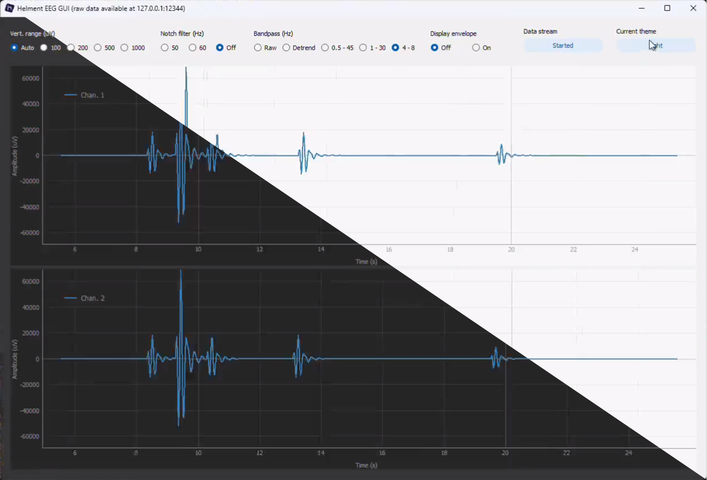

# Neuri GUI

Neuri is an EEG board developed by Helment. This GUI is working with Neuri versions 1.x and 2.x. The GUI has the following features:
1. Set multiple parameters for real-time signal visualization
2. Forward the signal (raw) in to a serial port located at 127.0.0.1:XYZ. This allows you to connect any of your applications to the GUI and to work with the acquired signal in real-time.
3. Store the data in an open text format for offline analysis.

## Setup

The GUI is distributed as a Python program. The GUI should work with **Python versions 3.10 or higher**.

You can set up the environment (Python **libraries**) by running:
`pip install -r requirements.txt`

Please note that the GUI is also using the **tkinter** framework which is not installable via `pip`. You have to install this during installation of the Python language. On GNU/Linux-based systems, it can be installed via the package manager (apt for Ubuntu):
`apt install python3-tk`

### GNU/Linux

Other Linux specific steps are:
- Python Image Library (PIL): `apt install python3-pil.imagetk`
- PyQt dependencies for X server: `sudo apt install libgl1-mesa-dev libxcb*-dev libfontconfig1-dev libxkbcommon-x11-dev libgtk-3-dev`
- Nuitka compilations: `sudo apt install patchelf`

## Compilation

The compiled version the the Neuri GUI runs way faster and has more stable  execution speed of iteration loops inside the backend of the GUI. You can **compile the GUI with Nuitka**:
- Windows: `nuitka ./neuri_gui.py --onefile --enable-plugin=tk-inter --standalone --enable-plugin=pyqt5 --include-data-dir=./frontend/=data --windows-icon-from-ico=frontend/Isotipo-Helment-color.ico --windows-disable-console`
- GNU/Linux: `nuitka3 ./neuri_gui.py --onefile --enable-plugin=tk-inter --standalone --enable-plugin=pyqt5 --include-data-dir=./frontend/=data --windows-icon-from-ico=frontend/Isotipo-Helment-color.ico --windows-disable-console` (note the 3 in nuitka3 compared to Windows)

## Overview

