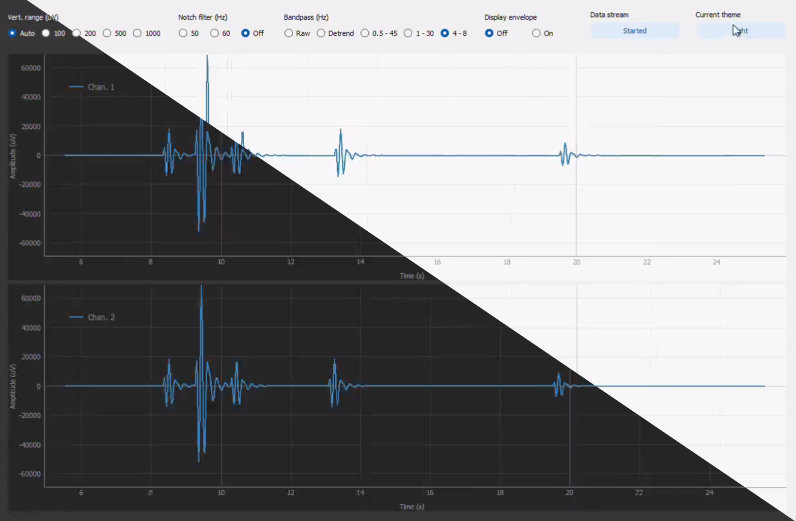

# Neuri GUI

print("Hello, Volt!")

A graphical interface for electrophysiological biosensors that allows you to:
1. Set multiple parameters for real-time signal visualization
2. Forward the signal (raw) in to a serial port located at 127.0.0.1:XYZ. This allows you to connect any of your applications to the GUI and to work with the acquired signal in real-time.
3. Store the data in an open text format for offline analysis (default: "Neuri_[datetime].txt")



Watch the introduction on Youtube:

[](https://www.youtube.com/embed/8DbGR9KUszQ)

## Compatible devices

- BioAmp EXG Pill by Upside Down Labs
- Muse S 2nd Gen by InteraXon Inc. (see statement below)
- Neuri 1.x by Helment
- Neuri-Lolin S3-PRO by Helment


> ⚠️ **Warning:** Muse devices are best to be used with InteraXon Inc.'s own software packages such as Muse Lab, Muse Direct and the Muse mobile app. They have been refined and optimized over years and you will have a better time using those over the NeuriGUI!

## Setup

The GUI is distributed as a Python module and works with **Python versions 3.9 or higher**.

### Installing and running

The easiest way of setting up your environment is to install NeuriGUI via PiPy: `pip install neurigui`. You can then run it as follows:
```
import neuri.gui as ng
ng.Run()
```

The GUI can be run directly from an IDE by calling the `Run()` function found in "./neuri/gui.py".

> **ℹ️ Info:** Note that your settings are stored in a "settings.cfg" file inside the current workspace directory of the IDE or terminal.

### Preparing Python libraries

You can set up the environment (Python **libraries**) by running:
`pip install -r requirements.txt` (file found in root folder of project)

Please note that the GUI is also using the **tkinter** framework which is **not** installable via `pip`. On Windows, it is automatically installed during installation of Python. On GNU/Linux-based systems, it can be installed via the package manager (apt for Ubuntu):
`apt install python3-tk`

### GNU/Linux

Other Linux specific steps are:
- Python Image Library (PIL): `apt install python3-pil.imagetk`
- PyQt dependencies for X server: `sudo apt install libgl1-mesa-dev libxcb*-dev libfontconfig1-dev libxkbcommon-x11-dev libgtk-3-dev`
- For compilations with Nuitka: `sudo apt install patchelf`

### Compilation

The compiled version the the Neuri GUI runs way faster and has more stable  execution speed of iteration loops inside the backend of the GUI. You can **compile the GUI with Nuitka**:
- Windows: `nuitka ./gui.py --onefile --enable-plugin=tk-inter --standalone --enable-plugin=pyqt5 --include-data-dir=./frontend/=data --windows-icon-from-ico=frontend/Neuri_logo.ico --windows-disable-console`
- GNU/Linux: `nuitka3 ./gui.py --onefile --enable-plugin=tk-inter --standalone --enable-plugin=pyqt5 --include-data-dir=./frontend/=data --windows-icon-from-ico=frontend/Neuri_logo.ico --windows-disable-console` (note the 3 in nuitka3 compared to Windows)

### Packaging

The GUI is packageable into a **Python module**. For this, run inside the root folder (NeuriGUI) of the project:
- Windows: `python -m build`
- GNU/Linux: `python3 -m build`

## Troubleshooting

1. If the GUI seems to be stuck, check the following:
- Did you set the right port (ie COM12 vs COM13)?

2. GitHub authentication errors might arise from the fact that Python is using the "github" package instead of the "pygithub" one when performing `from github import Github`. Try uninstalling github and install the pygithub package:
```
pip uninstall github
pip install pygithub
```
